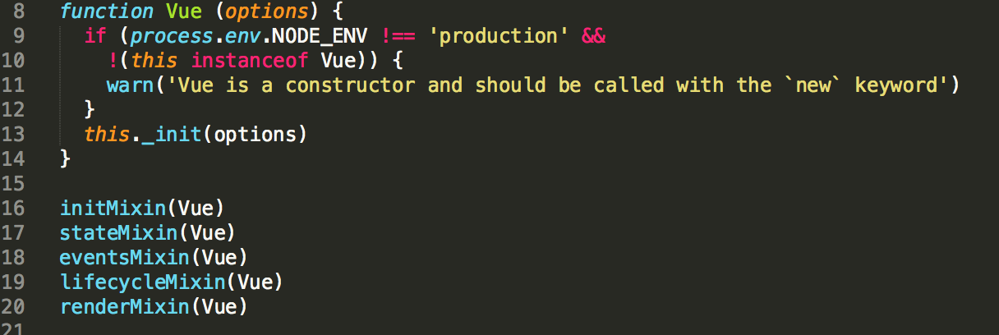
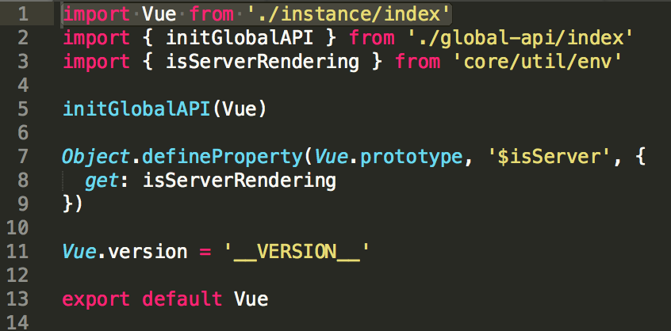
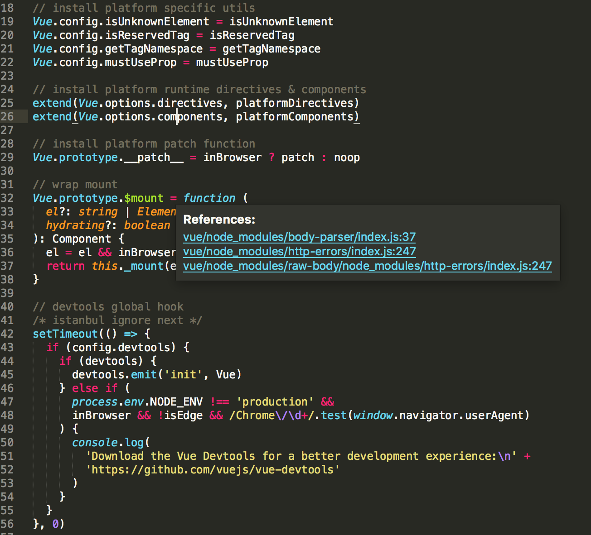
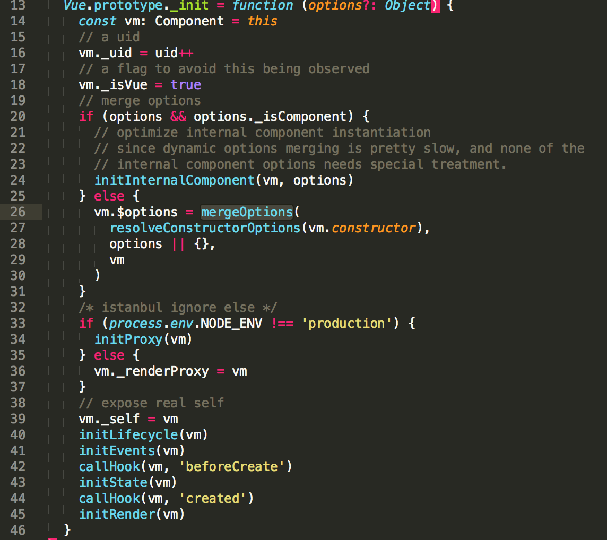

###  看源码的小提示

注重大体框架，从宏观到微观


```
一、createElement(): 用 JavaScript对象(虚拟树) 描述 真实DOM对象(真实树)
二、diff(oldNode, newNode) : 对比新旧两个虚拟树的区别，收集差异 
三、patch() : 将差异应用到真实DOM树
```

### vue的构造器

### 首先我们来看 

`npm run dev` 这条指令会生成vue.js

在package.json中我们可以看到
>"dev": "TARGET=web-full-dev rollup -w -c build/config.js"

找到`config.js`我们可以看到

	  'web-full-dev': {
	    entry: path.resolve(__dirname, '../src/entries/web-runtime-with-compiler.js'),
	    dest: path.resolve(__dirname, '../dist/vue.js'),
	    format: 'umd',
	    env: 'development',
	    alias: { he: './entity-decoder' },
	    banner
	  },


此处可以看到入口文件和出口文件

	entry: path.resolve(__dirname, '../src/entries/web-runtime-with-compiler.js'),
    dest: path.resolve(__dirname, '../dist/vue.js'),
    
 
然后我们就从这个文件一直追寻vue的构造函数

首先我们进入`web-runtime-with-compiler.js`可以看到
>import Vue from './web-runtime'


一直跳转下去会看到
>import Vue from 'core/index'


>import Vue from './instance/index'

直到此时你会看到`Vue`的构造函数


然后以vue的构造函数为参数调用了五个方法


经过这五个方法后我们看总结下Vue.prototype上的挂载的方法或属性

	> initMixin(Vue)	src/core/instance/init.js 
	**************************************************
	Vue.prototype._init = function (options?: Object) {}
	
	> stateMixin(Vue)	src/core/instance/state.js 
	**************************************************
	Vue.prototype.$data
	Vue.prototype.$set = set
	Vue.prototype.$delete = del
	Vue.prototype.$watch = function(){}
	
	> eventsMixin(Vue)	src/core/instance/events.js 
	**************************************************
	Vue.prototype.$on = function (event: string, fn: Function): Component {}
	Vue.prototype.$once = function (event: string, fn: Function): Component {}
	Vue.prototype.$off = function (event?: string, fn?: Function): Component {}
	Vue.prototype.$emit = function (event: string): Component {}
	
	> lifecycleMixin(Vue)	src/core/instance/lifecycle.js 
	**************************************************
	Vue.prototype._mount = function(){}
	Vue.prototype._update = function (vnode: VNode, hydrating?: boolean) {}
	Vue.prototype._updateFromParent = function(){}
	Vue.prototype.$forceUpdate = function () {}
	Vue.prototype.$destroy = function () {}
	
	> renderMixin(Vue)	src/core/instance/render.js 
	**************************************************
	Vue.prototype.$nextTick = function (fn: Function) {}
	Vue.prototype._render = function (): VNode {}
	Vue.prototype._s = _toString
	Vue.prototype._v = createTextVNode
	Vue.prototype._n = toNumber
	Vue.prototype._e = createEmptyVNode
	Vue.prototype._q = looseEqual
	Vue.prototype._i = looseIndexOf
	Vue.prototype._m = function(){}
	Vue.prototype._o = function(){}
	Vue.prototype._f = function resolveFilter (id) {}
	Vue.prototype._l = function(){}
	Vue.prototype._t = function(){}
	Vue.prototype._b = function(){}
	Vue.prototype._k = function(){}

### 这些方法你可以看一眼留个印象后文会用到

>到目前为止只是最开始我们找到的最后一个文件对Vue的处理都是在原型上挂的一超级方法和属性下边我们一个文件一个文件往前看

> 从instance/index导出Vue后进入找到`'core/index'`



>此文件主要导入 initGlobalAPI 和 isServerRendering，之后将Vue作为参数传给 initGlobalAPI ，最后又在 Vue.prototype 上挂载了 $isServer ，在 Vue 上挂载了 version 属性。
>我们看下initGlobalAPI做了什么处理


>经过这个文件处理后


	// src/core/index.js / src/core/global-api/index.js
	Vue.config
	Vue.util = util
	Vue.set = set
	Vue.delete = del
	Vue.nextTick = util.nextTick
	Vue.options = {
	    components: {
	        KeepAlive
	    },
	    directives: {},
	    filters: {},
	    _base: Vue
	}
	Vue.use
	Vue.mixin
	Vue.cid = 0
	Vue.extend
	Vue.component = function(){}
	Vue.directive = function(){}
	Vue.filter = function(){}
	
	Vue.prototype.$isServer
	Vue.version = '__VERSION__'

>下一个文件是web-runtime.js



### 主要做了三件事

>1、覆盖 Vue.config 的属性，将其设置为平台特有的一些方法

>2、Vue.options.directives 和 Vue.options.components 安装平台特有的指令和组件

>3、在 Vue.prototype 上定义 __patch__ 和 $mount

	// 安装平台特定的utils
	Vue.config.isUnknownElement = isUnknownElement
	Vue.config.isReservedTag = isReservedTag
	Vue.config.getTagNamespace = getTagNamespace
	Vue.config.mustUseProp = mustUseProp
	// 安装平台特定的 指令 和 组件
	Vue.options = {
	    components: {
	        KeepAlive,
	        Transition,
	        TransitionGroup
	    },
	    directives: {
	        model,
	        show
	    },
	    filters: {},
	    _base: Vue
	}
	Vue.prototype.__patch__
	Vue.prototype.$mount

>最后一个文件


### 主要两件事

> 1、缓存来自 web-runtime.js 文件的 $mount 函数

> 2、在 Vue 上挂载 compile

### 至此，我们还原了Vue构造函数

	1、Vue.prototype 下的属性和方法的挂载主要是在 src/core/instance 目录中的代码处理的

	2、Vue 下的静态属性和方法的挂载主要是在 src/core/global-api 目录下的代码处理的
	
	3、web-runtime.js 主要是添加web平台特有的配置、组件和指令，web-runtime-with-compiler.js 给Vue的 $mount 方法添加 compiler 编译器，支持 template。


## 下面我们能过一个小demo来看下Vue都干了什么


>我们来看下发生了什么

	function Vue (options) {
	  if (process.env.NODE_ENV !== 'production' &&
	    !(this instanceof Vue)) {
	    warn('Vue is a constructor and should be called with the `new` keyword')
	  }
	  this._init(options)
	}

>_init就是Vuew调用的第一个方法(src/core/instance/init.js



>分析下就可以知道执行了下列方法

	vm.$options = mergeOptions(
      resolveConstructorOptions(vm.constructor),
      options || {},
      vm
    )
    vm._self = vm
    initLifecycle(vm)
    initEvents(vm)
    callHook(vm, 'beforeCreate')
    initState(vm)
    callHook(vm, 'created')
    initRender(vm)

>mergeOptions 
	
	vm.constructor其实就是Vue

>resolveConstructorOptions

	function resolveConstructorOptions (Ctor: Class<Component>) {
	  let options = Ctor.options
	  // 其实就是Vue.options
	  // 前面已经总结过
	  // Vue.options = {
		//     components: {
		//         KeepAlive,
		//         Transition,
		//         TransitionGroup
		//     },
		//     directives: {
		//         model,
		//         show
		//     },
		//     filters: {},
		//     _base: Vue
		// }

	  if (Ctor.super) {
	    const superOptions = Ctor.super.options
	    const cachedSuperOptions = Ctor.superOptions
	    const extendOptions = Ctor.extendOptions
	    if (superOptions !== cachedSuperOptions) {
	      // super option changed
	      Ctor.superOptions = superOptions
	      extendOptions.render = options.render
	      extendOptions.staticRenderFns = options.staticRenderFns
	      extendOptions._scopeId = options._scopeId
	      options = Ctor.options = mergeOptions(superOptions, extendOptions)
	      if (options.name) {
	        options.components[options.name] = Ctor
	      }
	    }
	  }
	  return options
	}
	
>了解了这些后我们来看下mergeOptions(src/core/util/options.js)

	// 1、引用依赖
	import Vue from '../instance/index'
	其他引用...
	
	// 2、合并父子选项值为最终值的策略对象，此时 strats 是一个空对象，因为 config.optionMergeStrategies = Object.create(null)
	const strats = config.optionMergeStrategies
	// 3、在 strats 对象上定义与参数选项名称相同的方法
	strats.el = 
	strats.propsData = function (parent, child, vm, key){}
	strats.data = function (parentVal, childVal, vm)
	
	config._lifecycleHooks.forEach(hook => {
	  strats[hook] = mergeHook
	})
	
	config._assetTypes.forEach(function (type) {
	  strats[type + 's'] = mergeAssets
	})
	
	strats.watch = function (parentVal, childVal)
	
	strats.props =
	strats.methods =
	strats.computed = function (parentVal: ?Object, childVal: ?Object)
	// 默认的合并策略，如果有 `childVal` 则返回 `childVal` 没有则返回 `parentVal`
	const defaultStrat = function (parentVal: any, childVal: any): any {
	  return childVal === undefined
	    ? parentVal
	    : childVal
	}
	
	// 4、mergeOptions 中根据参数选项调用同名的策略方法进行合并处理
	export function mergeOptions (
	  parent: Object,
	  child: Object,
	  vm?: Component
	): Object {
	
	  // 其他代码
	  ...
	
	  const options = {}
	  let key
	  for (key in parent) {
	    mergeField(key)
	  }
	  for (key in child) {
	    if (!hasOwn(parent, key)) {
	      mergeField(key)
	    }
	  }
	  function mergeField (key) {
	    const strat = strats[key] || defaultStrat
	    options[key] = strat(parent[key], child[key], vm, key)
	  }
	  return options
	}
	

>其实就是合并策略函数，之后第二部事件：初始化工作与Vue实例对象的设计
>前面讲了 Vue 构造函数的设计，并且整理了 Vue原型属性与方法 和 Vue静态属性与方法，而 Vue 实例对象就是通过构造函数创造出来的，让我们来看一看 Vue 实例对象是如何设计的，下面的代码是 _init()方法合并完选项之后的代码：

	/* istanbul ignore else */
	   if (process.env.NODE_ENV !== 'production') {
	     initProxy(vm)
	   } else {
	     vm._renderProxy = vm
	   }
	
	   // expose real self
		vm._self = vm
	   initLifecycle(vm)
	   initEvents(vm)
	   callHook(vm, 'beforeCreate')
	   initState(vm)
	   callHook(vm, 'created')
	   initRender(vm)

>根据上面的代码，在生产环境下会为实例添加两个属性，并且属性值都为实例本身：
>然后，调用了四个 init* 方法分别为：initLifecycle、initEvents、initState、initRender，且在 initState 前后分别回调了生命周期钩子 beforeCreate 和 created，而 initRender 是在 created 钩子执行之后执行的，看到这里，也就明白了为什么 created 的时候不能操作DOM了。因为这个时候还没有渲染真正的DOM元素到文档中。created 仅仅代表数据状态的初始化完成。

>下边是对四个init方法进行了总结

	// 在 Vue.prototype._init 中添加的属性 
	**********************************************************
	this._uid = uid++
	this._isVue = true
	this.$options = {
	    components,
	    directives,
	    filters,
	    _base,
	    el,
	    data: mergedInstanceDataFn()
	}
	this._renderProxy = this
	this._self = this
	
	// 在 initLifecycle 中添加的属性		
	**********************************************************
	this.$parent = parent
	this.$root = parent ? parent.$root : this
	 
	this.$children = []
	this.$refs = {}
	
	this._watcher = null
	this._inactive = false
	this._isMounted = false
	this._isDestroyed = false
	this._isBeingDestroyed = false
	
	// 在 initEvents	 中添加的属性	 	
	**********************************************************
	this._events = {}
	this._updateListeners = function(){}
	
	// 在 initState 中添加的属性		
	**********************************************************
	this._watchers = []
	    // initData
	    this._data
	
	// 在 initRender	 中添加的属性 	
	**********************************************************
	this.$vnode = null // the placeholder node in parent tree
	this._vnode = null // the root of the child tree
	this._staticTrees = null
	this.$slots
	this.$scopedSlots
	this._c
	this.$createElement

>以上就是一个Vue实例所包含的属性和方法，除此之外要注意的是，在 initEvents 中除了添加属性之外，如果有 vm.$options._parentListeners 还要调用 vm._updateListeners() 方法，在 initState 中又调用了一些其他init方法，如下：


	function initState (vm: Component) {
	  vm._watchers = []
	  initProps(vm)
	  initMethods(vm)
	  initData(vm)
	  initComputed(vm)
	  initWatch(vm)
	}
>最后在 initRender 中如果有 vm.$options.el 还要调用 vm.$mount(vm.$options.el)，如下：

	if (vm.$options.el) {
	  vm.$mount(vm.$options.el)
	}
>这就是为什么如果不传递 el 选项就需要手动 mount 的原因了。

>那么我们依照我们本节开头的的例子，以及初始化的先后顺序来逐一看一看都发生了什么。我们将 initState 中的 init* 方法展开来看，执行顺序应该是这样的（从上到下的顺序执行）：

	initLifecycle(vm)
	initEvents(vm)
	callHook(vm, 'beforeCreate')
	initProps(vm)
	initMethods(vm)
	initData(vm)
	initComputed(vm)
	initWatch(vm)
	callHook(vm, 'created')
	initRender(vm)
>首先是 initLifecycle，这个函数的作用就是在实例上添加一些属性，然后是 initEvents，由于 vm.$options._parentListeners 的值为 undefined 所以也仅仅是在实例上添加属性， vm._updateListeners(listeners) 并不会执行，由于我们只传递了 el 和 data，所以 initProps、initMethods、initComputed、initWatch 这四个方法什么都不会做，只有 initData 会执行。最后是 initRender，除了在实例上添加一些属性外，由于我们传递了 el 选项，所以会执行 vm.$mount(vm.$options.el)。

>综上所述：按照我们的例子那样写，初始化工作只包含两个主要内容即：initData 和 initRender。


### initData


### initRender


