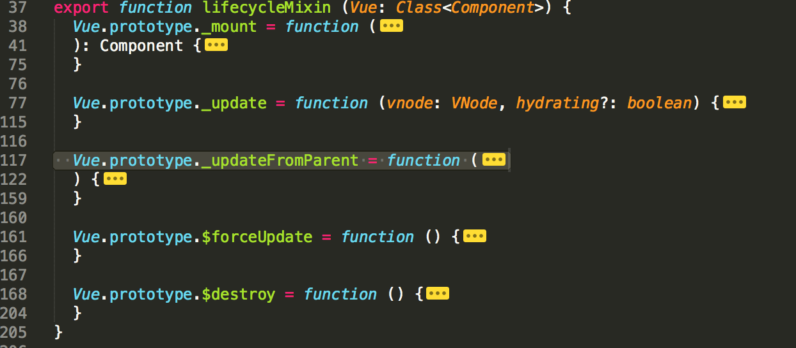
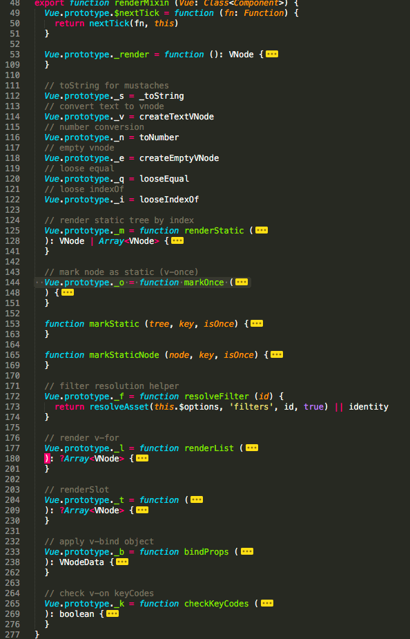

###  看源码的小提示

注重大体框架，从宏观到微观


```
一、createElement(): 用 JavaScript对象(虚拟树) 描述 真实DOM对象(真实树)
二、diff(oldNode, newNode) : 对比新旧两个虚拟树的区别，收集差异 
三、patch() : 将差异应用到真实DOM树
```

### vue的构造器

### 首先我们来看 

`npm run dev` 这条指令会生成vue.js

在package.json中我们可以看到
>"dev": "TARGET=web-full-dev rollup -w -c build/config.js"

找到`config.js`我们可以看到

	  'web-full-dev': {
	    entry: path.resolve(__dirname, '../src/entries/web-runtime-with-compiler.js'),
	    dest: path.resolve(__dirname, '../dist/vue.js'),
	    format: 'umd',
	    env: 'development',
	    alias: { he: './entity-decoder' },
	    banner
	  },


此处可以看到入口文件和出口文件

	entry: path.resolve(__dirname, '../src/entries/web-runtime-with-compiler.js'),
    dest: path.resolve(__dirname, '../dist/vue.js'),
    
 
然后我们就从这个文件一直追寻vue的构造函数

首先我们进入`web-runtime-with-compiler.js`可以看到
>import Vue from './web-runtime'


一直跳转下去会看到
>import Vue from 'core/index'


>import Vue from './instance/index'

直到此时你会看到`Vue`的构造函数


然后以vue的构造函数为参数调用了五个方法





经过这五个方法后我们看总结下Vue.prototype上的挂载的方法或属性

	> initMixin(Vue)	src/core/instance/init.js 
	**************************************************
	Vue.prototype._init = function (options?: Object) {}
	
	> stateMixin(Vue)	src/core/instance/state.js 
	**************************************************
	Vue.prototype.$data
	Vue.prototype.$set = set
	Vue.prototype.$delete = del
	Vue.prototype.$watch = function(){}
	
	> eventsMixin(Vue)	src/core/instance/events.js 
	**************************************************
	Vue.prototype.$on = function (event: string, fn: Function): Component {}
	Vue.prototype.$once = function (event: string, fn: Function): Component {}
	Vue.prototype.$off = function (event?: string, fn?: Function): Component {}
	Vue.prototype.$emit = function (event: string): Component {}
	
	> lifecycleMixin(Vue)	src/core/instance/lifecycle.js 
	**************************************************
	Vue.prototype._mount = function(){}
	Vue.prototype._update = function (vnode: VNode, hydrating?: boolean) {}
	Vue.prototype._updateFromParent = function(){}
	Vue.prototype.$forceUpdate = function () {}
	Vue.prototype.$destroy = function () {}
	
	> renderMixin(Vue)	src/core/instance/render.js 
	**************************************************
	Vue.prototype.$nextTick = function (fn: Function) {}
	Vue.prototype._render = function (): VNode {}
	Vue.prototype._s = _toString
	Vue.prototype._v = createTextVNode
	Vue.prototype._n = toNumber
	Vue.prototype._e = createEmptyVNode
	Vue.prototype._q = looseEqual
	Vue.prototype._i = looseIndexOf
	Vue.prototype._m = function(){}
	Vue.prototype._o = function(){}
	Vue.prototype._f = function resolveFilter (id) {}
	Vue.prototype._l = function(){}
	Vue.prototype._t = function(){}
	Vue.prototype._b = function(){}
	Vue.prototype._k = function(){}

### 这些方法你可以看一眼留个印象后文会用到


